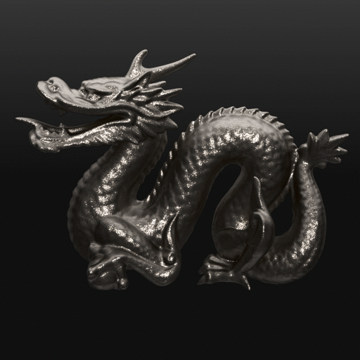

:warning: **THIS IS EXPERIMENTAL SOFTWARE** :warning:

# 
[API](doc/API.md) |
[Example](#example) |
[Installation](#installation) |
[Changelog](doc/CHANGELOG.md) |
[License](#license) (MIT) |
[Questions?](#questions)

normalmap.js is a library for creating simple interactive lighting effects.

- Built on top of WebGL
- Simple to use
- Small (~7kb gzipped)
- Fast enough to run on modern smartphones
- There is a tiny jQuery plugin for simple usage
- Covered by [automated end-to-end tests](https://29a.ch/sandbox/2016/normalmap.js/tests/)

# Demos
[](https://29a.ch/sandbox/2016/normalmap.js/)

Did you find a cool use for normalmap.js? [Let me know!](https://29a.ch/about)

# Example
```javascript
var lights = normalmap({
    canvas: canvas,
    normalMap: normalMap,
    baseColor: [0.5, 0.4, 0.5]
});

lights.clear();

var position = normalMap.vec3(0.5, 0.5, 1.0); // dead center
var color = normalMap.vec3(1.0, 1.0, 1.0); // bright white
lights.addPointLight(position, color);
```

# Installation
With NPM:
```
$ npm install normalmap
```

```javascript
var normalmap = require('normalmap');
```

With Bower:
```$ bower install normalmap```

Or just download the latest zip file form the [releases page](https://github.com/jwagner/normalmap.js/releases).

Note that normalmap.js won't work with file:// urls. You will need to serve
images from a webserver. See Richard Daveys [phaser introduction](http://phaser.io/tutorials/getting-started) for an explanations for this.

# Browser Support

Normalmap.js should work in all browsers that [supports WebGL](http://caniuse.com/#feat=webgl).

# API Documentation

[doc/API.md](doc/API.md)

# Changelog
[doc/CHANGELOG.md](doc/CHANGELOG.md)

# Creating normal maps
[NormalMap-Online](http://cpetry.github.io/NormalMap-Online/)

# Questions?
Create a github issue or tweet to [@29a_ch](https://twitter.com/29a_ch) and please be a bit patient. :)

# License
Copyright © 2016 Jonas Wagner.

The **source code** of this project licensed under the [MIT License](LICENSE) (enclosed).

The images and textures used for demonstration purposes are **not** licensed under the MIT License and belong to their respective owners.
