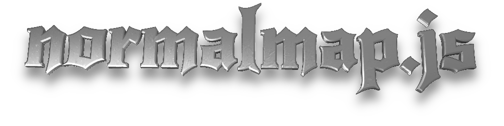

# 
:warning: **THIS IS EXPERIMENTAL SOFTWARE - THE API IS NOT FINAL** :warning:

# API Documentation
[normalmap.js](#api-documentation) | [jquery.normalmap.js](#jquery-normalmap-js)

## normalmap(config)

### config properties

| property               | type            | default     |
|:-----------------------|:----------------|:------------|
| canvas (*required*)    | `<canvas>`      | `undefined` |
| normalMap (*required*) | `image`         | `undefined` |
| baseColorMap           | `image`         | `undefined` |
| materialMap            | `image`         | `undefined` |
| ambientMap             | `image`         | `undefined` |
| baseColor              | `color`         | `undefined` |
| ambient                | `Number` [0, 1] | 1           |
| metalness              | `Number` [0, 1] | 1           |
| roughness              | `Number` [0, 1] | 1           |
| antiAliasing           | boolean         | false       |
| onContextRestored      | function()      | `undefined` |
| repeat                 | boolean         | false       |
| singlePass             | boolean         | false       |
| subSurfaceScattering   | `Number` [0, 4] | 0           |


The material system is similar to the *Physically Based Materials* in in [Unreal Engine 4](https://docs.unrealengine.com/latest/INT/Engine/Rendering/Materials/PhysicallyBased/index.html).

Read the [Input Texture Packing](#input-texture-packing) and
[Material Properties](#material-properties) sections to learn more
about these properties.

#### antiAliasing
Runs an FXAA pass on the accumulated buffers. Makes results look a lot smoother for
better or worse. Not compatible with singlePass.

#### onContextRestored
This function is called after the WebGL context has been lost and successfully restored. When this happens you will have to add all your lights again.
You can find an example of handling this in demos/demo.js.
You can also just ignore this edge case as it only happens relatively rarely.

#### repeat
Allows you to use repeating textures. If true the texture will be repeated to
fill the canvas. The texture must be square and it's side length needs to be a
power of two. So 128x128 or 32x32 is fine while 666x1337 won't work.

#### singlePass
Uses a faster rendering method but allows only one light to be used.

### subSurfaceScattering
Applies a simple mip bias to the diffuse normal map lookup. So you will only see
an effect on non metallic materials.


### Return Value
A lights instance.

## lights instance methods


### addPointLight(position, color)
Add light coming from a single point to the canvas

#### Parameters
- `vec3` **position** of the light source
- `vec3` **color** of the emitted light

#### Return Value
None.


### addDirectionalLight(direction, color)
Add directional light coming from a light source at infinite distance.

#### Parameters
-  `vec3` *direction** of the light source, must be a unit vector.
-  `vec3` *color**  of the emitted light.

#### Return Value
None.

### configure(config)
Allows you to change config properties after initialization.
The following [config properties](#config-properties) can't be reconfigured:

- canvas
- repeat
- singlePass

**Note: calling configure won't redraw. The new values will only affect subsequent calls.**

### render()
Draws all the added and ambient light.
Doesn't do anything in `singlePass` mode where adding lights will result in
them being immediately drawn.


## normalMap.vec3(x, y, z)
Helper to create new `vec3`.

### Material Properties

| property  | description                                                                                                                                                           |
|:----------|:----------------------------------------------------------------------------------------------------------------------------------------------------------------------|
| normal    | indicates the direction which the surface is facing                                                                                                                   |
| normal x  | 0 = left, 256 = right                                                                                                                                                 |
| normal y  | 0 = bottom, 256 = top                                                                                                                                                 |
| alpha     | transparency of the output image                                                                                                                                      |
| baseColor | Controls the color of the surface (specular if metallic, diffuse otherwise)                                                                                           |
| metallic  | Set to 1 for metallic materials, 0 otherwise.                                                                                                                         |
| roughness | Set to 0 for very smooth materials, use 1 for very rough surfaces                                                                                                     |
| occlusion | Darkens both the specular and diffuse reflections. Useful for cavities or (to some extent) ambient occlusion. 0 = black body, 1 = no effect. Does not affect ambient. |
| ambient   | The ambient light. This should usually contain a full render of the image except for the lights that will be added by normalmap.js.                                   |

## Input Texture Packing

|                  | R             | G         | B         | A      |
|:-----------------|:--------------|:----------|:----------|:-------|
| **normalMap**    | normal x      | normal y  | normal z  | alpha  |
| **baseColorMap** | base r        | base g    | base b    | unused |
| **materialMap**  | metalness \m/ | roughness | occlusion | unused |
| **ambientMap**   | ambient r     | ambient g | ambient b | alpha |

Do not premuliply the alpha channel on rgba images.
ambientMap is assumed to be in *sRGB*, everything else in linear.

### A note on compression

Compressing textures can save bandwidth and result in faster load times.
From my experience the base, material and ambient maps still look good with quite
a bit of compression. Normal maps tend to suffer a lot when generic lossy image
compression algorithms are applied to them.

## Type Reference

### vec3
A `Float32Array` containing three numbers like `new Float32Array([2.5, 0.0, -1.0])`.
Can be created with the helper `normalmap.vec3(x, y, z)`.

### color
A `vec3` with all values in the interval **[0, 1]** for representing an RGB color.

### image

An ``, `<canvas>` or `<video>` element.
`<canvas>` and `<video>` will only be read once and won't react to changes.

The image must have been [completely available](https://html.spec.whatwg.org/multipage/embedded-content.html#img-all) and [cross origin clean](https://www.khronos.org/registry/webgl/specs/latest/1.0/#4.2).

This means no images from domains other than the one your current page is being served from
(unless they have explicitly set
[CORS headers](https://developer.mozilla.org/en-US/docs/Web/HTTP/Access_control_CORS)
that allow this) and no `file:` urls.

## jquery.normalmap.js

This is a little jQuery plugin to make using normalmap.js easier.
It takes care of loading image and handling browser resizes.
Instead of images you can just pass in a string pointing to it's source.

### Example
```javascript
$('#logo').normalmap({
    normalMap: 'gfx/logo.png',
    materialMap: 'gfx/logo-material.png',
    ambient: 0,
    metalness: 1.0,
    roughness: 0.3,
    baseColor: normalmap.vec3(1.000, 0.766, 0.336)
}).then(function(lights){
    lights.clear();
    lights.addPointLight(normalmap.vec3(0.5, 0.5, 1.0),
                         normalmap.vec3(0.5, 0.5, 0.5));
});
```
